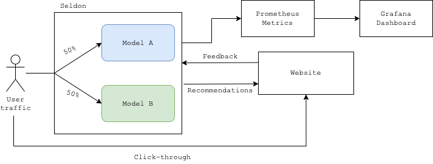

# A/B Recommenders
An end-to-end implementation of online recommender systems A/B testing

## Table of contents
* [Introduction](#introduction)
* [Background](#background)
* [Objective](#objectives)
* [Business Case](#business-case)
* [System design](#system-design)
* [Tools and packages](#tools-and-packages)
* [Data](#data)
* [Data preprocessing](#data-preprocessing)
* [Recommender system](#recommender-system)
* [Experiment design](#experiment-design)
* [Integration and deployment](#integration-and-deployment)
* [Results](#results)
* [Conclusion](#conclusion)
* [References](#references)
* [Challenges and future work](#challenges-and-future-work)

## Introduction

This is the first repository/tutorial from a series of others where I challenge myself to build, deploy and 
explain an end to end data science solution to a concrete business use case.

For this first project, the main goal is to demonstrate the design and deployment of an A/B test experiment comparing
the end business value of two different recommender systems (the user clicking on the recommendations).

While the compared machine learning models are recommendation systems, the approach detailed here works for comparing
two models of any type.
## Background

This project is inspired from a question I was asked during an interview : 
> How would you compare the performance of two recommender systems in production ?

I knew the theoretical answer to this question but found that I lacked some of the 
practical skills that would allow me to solve this problem and implement its solution in production.
So here we go !

## Objectives

#### Main objective :
Design and deploy an A/B test experiment evaluating and comparing the online performance of two different recommender 
systems.
#### Secondary objectives : 
* Train recommender systems
* Develop and deploy a proof of concept product website to run the experiment
* Automate the A/B testing experiment for testing purposes

## Example Business Case

Funflix, a movie streaming platform, wants to improve its recommendation engine. The model currently used in production 
has a click-through rate of 7% (called the baseline CTR). The Funflix data science team has developed
a newer recommender system, that supposedly recommends more relevant movies, and wants to test if it improves
user recommendation click-through rate.

## System design

The MovieLens 25M dataset will first be used to train two recommender systems, the baseline model and the supposedly
new model.
Recommendations prediction request from user traffic will be routed randomly to one of the two recommender
systems and recommendations will be shown on the website. If the user clicks on one of the recommendations, 
the click will be collected and stored to evaluate possible statistically significant change in click-through rate.



Kubernetes and Seldon Core will be used to deploy the two recommender systems. It will make this A/B testing experiment easier as
it will provide a unified endpoint to query for recommendations, taking care of the random routing and even feedback
and evaluation loop by collecting custom metrics such as in this case the click-through rate through a 
special feedback endpoint. It also integrates well with Prometheus and Grafana and that will allow us 
to monitor the experiment's results.

Flask will be used to build a mock website in order to test the implementation and run the mock A/B test experiment 
and selenium will be used to simulate user traffic and interaction on this website.

One ida to improve this overall system would be to also implement periodical online re-training so that the model 
would take into consideration new user interactions with movies. This improvement brings alone its fair share
of new problems (eg. long and costly retraining, adapting the A/B testing statistics) so we will focus here on the
deployment and serving of the models and the A/B test experiment.

## Project steps

1. Train the two compared recommender systems (baseline and new)
2. Design the A/B experiment
3. Deploy and serve the two models, configure deployment
4. Test deployment and serving
5. Develop the mock website
6. Automate user traffic and interaction
7. Explore and interpret the A/B experiment results

## Tools and packages

| Task        | Tools/Package                   |
|-------------|---------------------------------|
|Data & Statistics| numpy, scipy|
|Data visualisation| matplotlib|
| Model deployment and A/B testing | seldon core |
| Mock experiment website | Flask |
| Experiment simulation | selenium |
| Metrics and dashboard | Prometheus, Grafana |
| Deployment | Kubernetes, helm, Google |

## Data

The data used is the MovieLens 25M Dataset [[1]](#1). It is an industry standard recommender system benchmark. 
It contains 25M ratings of 62k different movies by 162k users. It can be downloaded 
[here](https://grouplens.org/datasets/movielens/). The following files are needed:

| File Name   | Description        | Columns                         |
|-------------|--------------------|---------------------------------|
| ratings.csv | Movies ratings     | userId,movieId,rating,timestamp |
| movies.csv  | Movies information | movieId,title,genres            |

The code in this repository assumes that the data is present in the ```/data``` folder, this can be easily modified.

## Data preprocessing

## Recommender system

It is worth noting that the recommender system obtained is still not perfect, especially in the production environment 
and use case presented. It suffers from several problems, one of them being cold start (which movies do we 
recommend to new users ?). The important objective here being the productionization and A/B testing experiment design
and deployment, the model developed here is probably enough for the scope of this project.

## Experiment design

## Integration and deployment

## Results

## Conclusion

## References

<a id="1">[1]</a> 
F. Maxwell Harper and Joseph A. Konstan. 2015. The MovieLens Datasets: History and Context. ACM Transactions on 
Interactive Intelligent Systems (TiiS) 5, 4: 19:1–19:19. https://doi.org/10.1145/2827872

## Challenges and future work
🚧 In progress 🚧